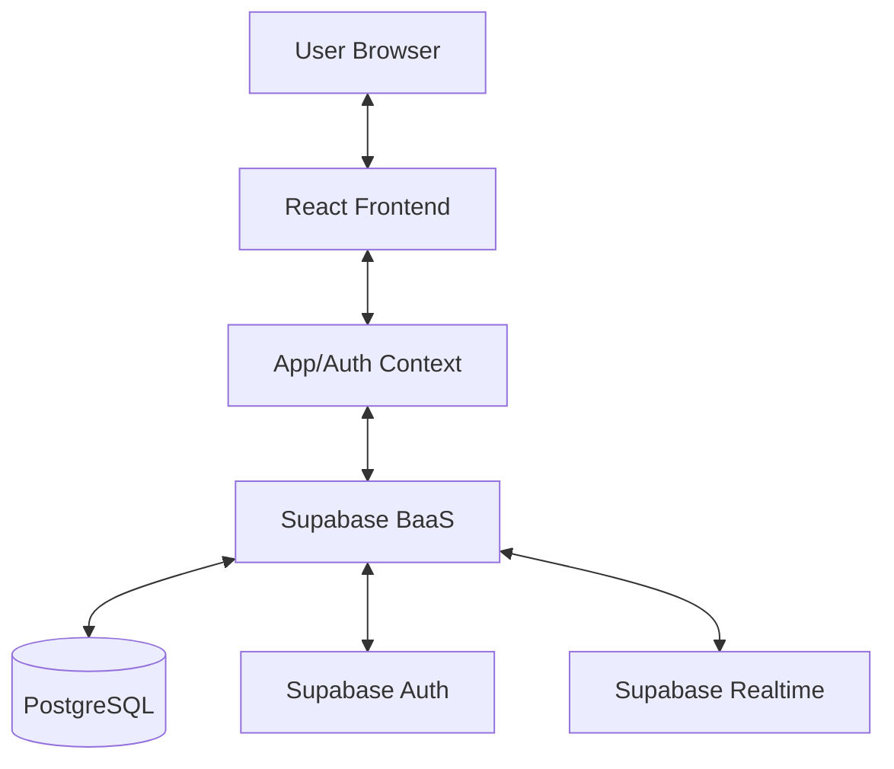

# Architecture Overview

This document describes the high-level architecture of SquareOne, explaining how the different parts of the system interact and how state is managed.

## System Architecture

SquareOne is a client-side heavy React application that leverages Supabase as a Backend-as-a-Service (BaaS).

## State Management

The application uses React Context API for global state management, split into two primary contexts:

### 1. AuthContext (`context/AuthContext.tsx`)
- Manages user authentication state.
- Handles sign-in, sign-up, and sign-out operations via Supabase Auth.
- Provides the current `user` object to the rest of the app.

### 2. AppContext (`context/AppContext.tsx`)
- Manages the core application data: `friends` and `transactions`.
- Handles data fetching and synchronization with Supabase.
- Provides methods for CRUD operations (e.g., `addTransaction`, `updateFriend`).
- Implements **Real-time Sync**: Listens for changes in the Supabase database and updates the local state automatically.

## Data Flow

1. **Initialization**: On app load, `AuthContext` checks for an existing session. If found, `AppContext` triggers a fetch for the user's friends and transactions.
2. **User Action**: When a user adds a transaction, the `addTransaction` method in `AppContext` is called.
3. **Optimistic/Real-time Update**:
   - The method sends the data to Supabase.
   - A real-time subscription listener in `AppContext` detects the change in the database.
   - The listener triggers a re-fetch or updates the local state, ensuring all components reflect the change.
4. **Calculations**: Balances are calculated on-the-fly in the frontend using utility functions (`utils/calculations.ts`) based on the raw transaction data.

## Component Design

### Neo Components (`components/NeoComponents.tsx`)
The app uses a consistent "Neo" (Neo-brutalist) design system. These are low-level UI components (Button, Input, Modal, Card) that provide the high-contrast, bold aesthetic used throughout the application.

### Feature Components
Larger components are organized by feature (e.g., `components/AddTransaction/`, `components/FriendDetail/`) to keep the `screens/` components clean and focused on layout.

## Key Utilities

- **`utils/supabase.ts`**: Configures and exports the Supabase client.
- **`utils/calculations.ts`**: Contains the logic for calculating friend balances and activity status.
- **`utils/formatters.ts`**: Helper functions for currency and date formatting.
