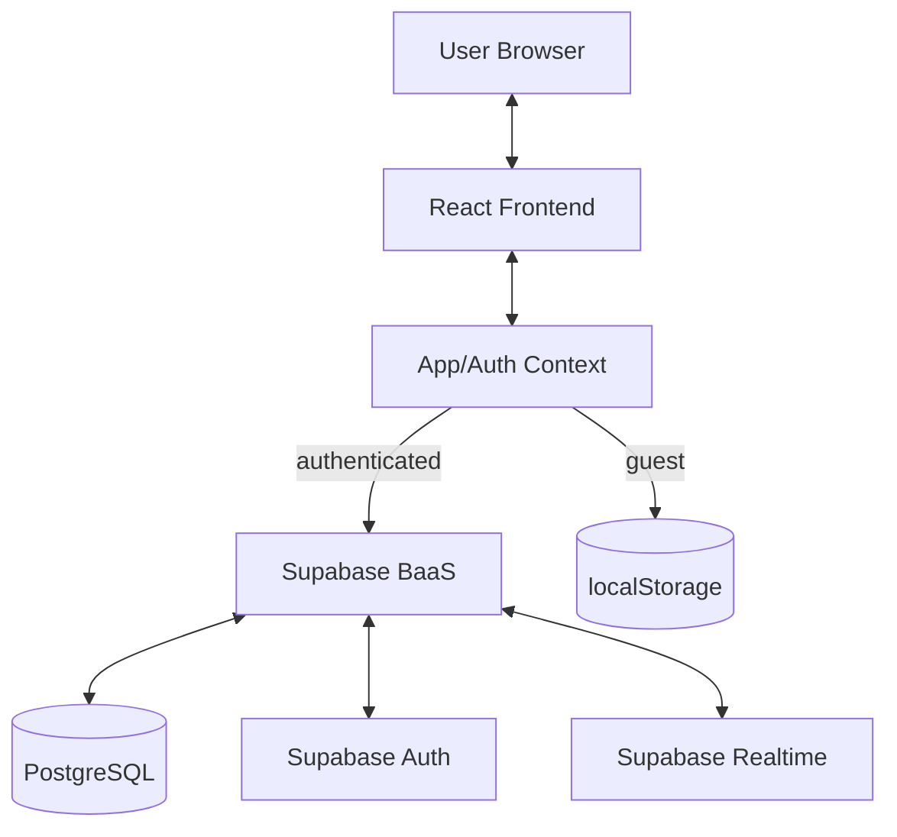

# Architecture Overview

This document describes the high-level architecture of SquareOne, explaining how the different parts of the system interact and how state is managed.

## System Architecture

SquareOne is a client-side React application that leverages Supabase as a Backend-as-a-Service (BaaS). Guest users bypass Supabase entirely and work against localStorage.

```mermaid
graph TD
    User[User Browser]
    React[React Frontend]
    Context[App/Auth Context]
    Supabase[Supabase BaaS]
    DB[(PostgreSQL)]
    Auth[Supabase Auth]
    Realtime[Supabase Realtime]
    LS[(localStorage)]

    User <--> React
    React <--> Context
    Context -- authenticated --> Supabase
    Context -- guest --> LS
    Supabase <--> DB
    Supabase <--> Auth
    Supabase <--> Realtime
```

## Routing

The app uses **React Router 7 with `HashRouter`**. All routes are prefixed with `/#/` (e.g. `/#/home`, `/#/friends`). This is important for Supabase Auth: OAuth and email confirmation `redirectTo` / `emailRedirectTo` values must include the hash prefix (e.g. `window.location.origin + '/#/dashboard'`) and must be registered in the Supabase project's allowed redirect URLs.

## State Management

The application uses React Context API for global state, split into two primary contexts:

### 1. AuthContext (`context/AuthContext.tsx`)
- Manages user authentication state.
- Handles sign-in, sign-up, sign-out, and social auth (Google, Apple) via Supabase Auth.
- Provides the current `user` object to the rest of the app.
- Loads the user's profile after sign-in using a `Promise.race` timeout guard.

### 2. AppContext (`context/AppContext.tsx`)
- Manages the core application data: `friends`, `transactions`, and `customTypes`.
- On mount, detects whether the session is authenticated or guest and routes all reads/writes accordingly.
- Provides methods for CRUD operations (e.g. `addTransaction`, `updateFriend`, `addCustomType`).
- **Real-time Sync**: For authenticated users, subscribes to Supabase PostgreSQL changes and updates local state automatically.

## Data Flow

### Authenticated path
1. `AuthContext` detects an existing session on load.
2. `AppContext` fetches `friends`, `transactions`, and `customTypes` from Supabase.
3. User actions call context methods → data written to Supabase → real-time subscription triggers local state update.
4. Balances are calculated on-the-fly in the frontend via `utils/calculations.ts`.

### Guest path
1. No Supabase session exists; `user.id === 'guest'`.
2. `AppContext` reads from and writes to `localStorage` via `utils/guestStorage.ts` (key: `squareone_guest_data`).
3. No network calls are made. All CRUD is synchronous localStorage operations.
4. Guest data is cleared when a real account session attaches (`clearGuestLocalData`).

## Component Design

### Neo Components (`components/NeoComponents.tsx`)
The app uses a consistent "Neo" (Neo-brutalist) design system. These are low-level UI primitives (Button, Input, Modal, Card) that provide the high-contrast, bold aesthetic throughout the application.

### Feature Components
Larger components are organized by feature (e.g. `components/AddTransaction/`, `components/FriendDetail/`) to keep `screens/` components focused on layout and composition.

## Animation Layer

All motion is handled by **Framer Motion**:

- `utils/animations.ts` — spring configs and reusable animation variants (fade, slide, bounce, shake, stagger).
- `hooks/useAnimations.ts` — wraps `useReducedMotion()` and converts all variants to instant transitions when the user has `prefers-reduced-motion` enabled.
- `hooks/useNumberCounter.ts` — smooth numeric counting for balance displays.
- `components/AnimatedNumber.tsx` — reusable animated number component used on Home and SettleUp.
- `utils/confetti.ts` — canvas-confetti helpers for settlement success celebrations.

All animations use GPU-accelerated properties (`transform`, `opacity`) only.

## Key Utilities

- **`utils/supabase.ts`**: Configures and exports the Supabase client.
- **`utils/guestStorage.ts`**: localStorage CRUD for guest sessions.
- **`utils/calculations.ts`**: Friend balance and net balance calculations.
- **`utils/formatters.ts`**: Currency and date formatting helpers.
- **`utils/validation.ts`**: Amount expression validation (rejects incomplete expressions like `5+`).
